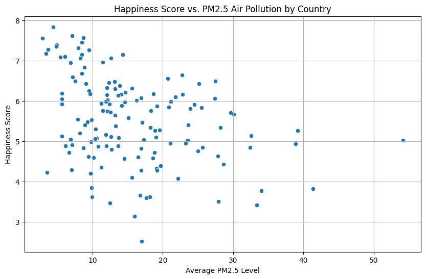
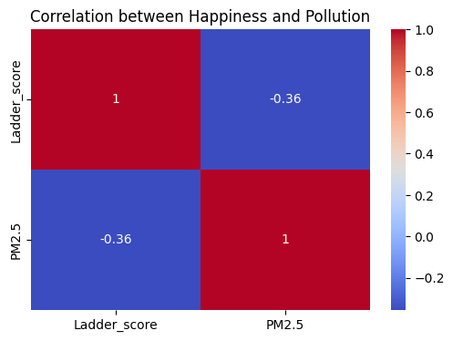

# 🌍 Pollution vs. Happiness: A Global Perspective

This project is part of the **Data Analyst Nanodegree** from **Udacity** that investigates whether higher air pollution levels (PM2.5) correlate with lower national happiness scores across countries.

It is part of Udacity’s **Data Wrangling project**, where we gather, assess, clean, merge, and analyze real-world datasets using pandas and visualization tools.

See the full notebook: [`notebook/Data_Wrangling_Project_Starter.ipynb`](notebook/Data_Wrangling_Project_Starter.ipynb)

---

## Research Question

**Does a higher level of PM2.5 air pollution correlate with lower happiness scores at the national level?**

---

## Datasets Used

- **World Happiness Report (2021)**: Survey-based happiness scores across countries.  
- **PM2.5 Pollution Data**: Fine particulate matter (PM2.5) levels by country, extracted from Wikipedia.

---

## Data Wrangling Process

- Gathered two datasets using **different methods**: one from a GitHub CSV, the other by scraping an HTML table.
- Cleaned issues including:
  - Zero pollution values (considered missing)
  - Multiple city-level entries for countries
  - Inconsistent column names
  - Mismatched observational units

- Aggregated data to **national level** and merged into a single dataset.

---

## Visualizations

### 1. Happiness Score vs. PM2.5 Air Pollution

A scatter plot suggests a **negative correlation** between air pollution and happiness scores:

---

### 2. Correlation Heatmap

Confirms a **moderate negative correlation** between `PM2.5` levels and `Ladder_score`:

